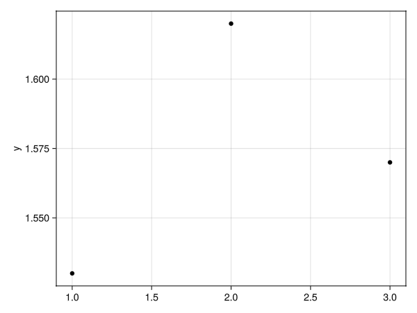
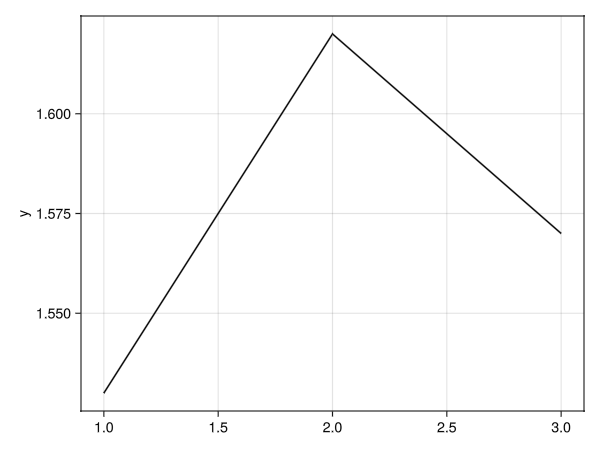
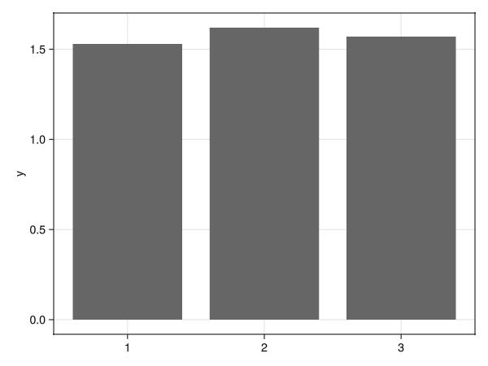
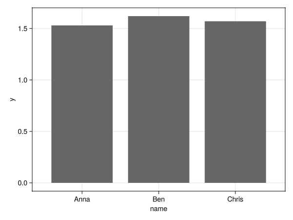
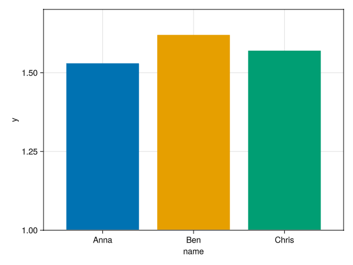
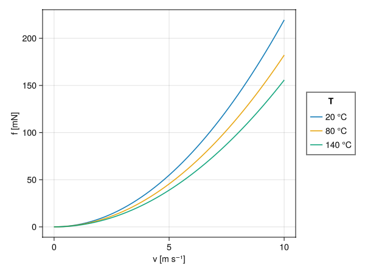
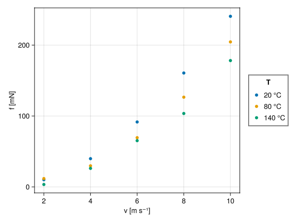
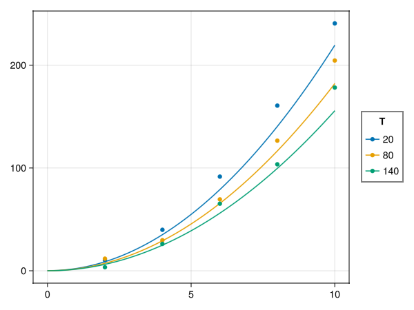
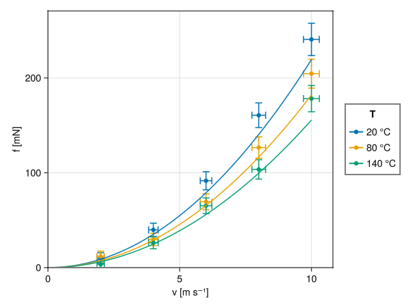

# Introduction to AlgebraOfGraphics

`AlgebraOfGraphics.jl` is a powerful and flexible library for creating plots in Julia. It uses a layered approach, allowing you to build complex plots from simple components. This introduction will walk you through some basic examples to get you started.

## Simple Plots from a Vector

Let's start with the most simple dataset - an one-dimensional array of data - and see how we can visualize it in different ways.

### Scatter Plot

A scatter plot is a great way to visualize individual data points.

```julia
using WGLMakie, AlgebraOfGraphics, DataFrames

d01 = (; y=[1.53, 1.62, 1.57])
fg1s = data(d01) * mapping(:y) * visual(Scatter) |> draw
```

This code creates a scatter plot of the `y` values. The `data` function specifies the data source, `mapping` determines how data components are mapped to visual properties of the plot (in this case, the `y` axis), and `visual` specifies the type of plot.



### Lines Plot

To see the trend between the data points, we can use a line plot.

```julia
fg1l = data(d01) * mapping(:y) * visual(Lines) |> draw
```



### Bar Plot

A bar plot is useful for comparing values.

```julia
fg1b = data(d01) * mapping(:y) * visual(BarPlot) |> draw
```



## Mapping Categorical Data

Now, let's add some categorical data to our plots.

### Bar Plot with Categories

We can map a categorical variable to the x-axis to create a bar plot with named bars.

```julia
d02 = (; y=[1.53, 1.62, 1.57], name=["Anna", "Ben", "Chris"])
fg2b = data(d02) * mapping(:name, :y) * visual(BarPlot) |> draw
```



### Colored Bar Plot

We can also use the categorical variable to color the bars.

```julia
plt2 = data(d02) * mapping(:name, :y; color=:name) * visual(BarPlot)
fg2bc = draw(plt2; legend=(show=false, ), axis=(limits=(nothing, nothing, 1.0, nothing),));
```

Here, we also adjusted the axis limits and hid the legend for a cleaner look.



## Working with Real Data: Air Drag Example

This section demonstrates more advanced AlgebraOfGraphics features using a realistic example: comparing theoretical air drag force calculations with experimental measurements. The air drag force on a sphere depends on velocity and temperature, which are our experimental variables. We'll progressively build up a complex multi-layer plot to show both theoretical predictions and measured data with error bars.

### Theoretical Data: Line Plots with Grouping

First, we calculate theoretical force values across a range of velocities at three different temperatures (20°C, 80°C, 140°C):

<details>
  <summary>Create data</summary>

```julia
using WGLMakie, AlgebraOfGraphics, DataFrames

# Air drag force calculation (simplified); v in m/s, T in °C, d in cm, 
f_theor(v; T=25, d=10, Cp=0.47) = 13.6816 * Cp * v^2 * d^2 / (273.15 + T) # mN

T = 20:60:140
v = 0:0.2:10

df = DataFrame(
    v = [v for v in v for _ in T],
    T = [t for _ in v for t in T],
    f = [f_theor(v, T=t) for v in v for t in T]
)
```

</details>

The resulting DataFrame has one row for each velocity-temperature combination:

```
51×3 DataFrame
 Row │ v        T      f       
     │ Float64  Int64  Float64 
─────┼───────────────────────────
   1 │     0.0     20      0.0
   2 │     0.0     80      0.0
   3 │     0.0    140      0.0
   ⋮
  50 │    10.0     80   3961.56
  51 │    10.0    140   3542.49
```

Now we create a line plot with separate curves for each temperature using the `group` aesthetic:

```julia
plt1 = data(df) * mapping(:v, :f; group=:T, color=:T => nonnumeric) * visual(Lines)
fig1 = plt1 |> draw
```

The `color=:T => nonnumeric` mapping tells AlgebraOfGraphics to treat temperature as a categorical variable for coloring purposes, creating distinct colors for each temperature value.



### Measured Data: Transforming from Wide to Long Format

Experimental measurements are often stored in a "wide" format. Here data for each temperature are in a separate column. 

<details>
  <summary>Create data</summary>

```julia
# Measured data at discrete velocities
vs = 2:2:10
f_measured = [10.17 11.78 3.43; 39.86 29.74 26.15; 91.6 69.46 65.26; 
              160.67 126.57 103.57; 240.65 204.54 178.22]

# Create wide-format DataFrame
Ts = (T .|> string)
m = hcat(vs, f_measured)
nms = vcat("v", Ts)
dfm = DataFrame(m, nms)
```

</details>

The wide-format DataFrame looks like this:

```
5×4 DataFrame
 Row │ v        20       80       140     
     │ Float64  Float64  Float64  Float64 
─────┼────────────────────────────────────
   1 │     2.0    10.17    11.78     3.43
   2 │     4.0    39.86    29.74    26.15
   3 │     6.0    91.6     69.46    65.26
   ⋮
   4 │     8.0   160.67   126.57   103.57
   5 │    10.0   240.65   204.54   178.22
```

AlgebraOfGraphics works best with "long" format data, so let's convert data to long format using `stack`:

<details>
  <summary>Convert table, add error values</summary>

```julia
dfl = stack(dfm, Ts)
rename!(dfl, :value => :f, :variable => :T)

# convert T into numeric data
transform!(dfl, :T => ByRow(s -> parse(Int, s)) => :T) 

# Add error estimates
dfl[!, :f_err] = @. round(5 + dfl[!, :f] * 0.05; digits=1)
dfl[!, :v_err] = @. round(0.1 + dfl[!, :v] * 0.02; digits=2)
```

</details>

The transformed long-format DataFrame with error columns:

```
15×5 DataFrame
 Row │ v        T      f        f_err    v_err   
     │ Float64  Int64  Float64  Float64  Float64 
─────┼──────────────────────────────────────────────
   1 │     2.0     20    10.17      5.5     0.14
   2 │     4.0     20    39.86      7.0     0.18
   3 │     6.0     20    91.6       9.6     0.22
   ⋮
  14 │     8.0    140   103.57     10.2     0.26
  15 │    10.0    140   178.22     13.9     0.3
```

Now we can create a scatter plot. Note how we are adding axes titles.

```julia
plt2 = data(dfl) * mapping(:v => "v [m/s]", :f => "f [mN]"; color=:T => nonnumeric) * visual(Scatter)
fig2 = plt2 |> draw
```



### Layering: Combining Multiple Plot Types

One of AlgebraOfGraphics' most powerful features is the ability to layer different plot types. We can combine our theoretical lines with the measured scatter points using the `+` operator:

```julia
fg12 = (plt1 + plt2) |> draw
```

This creates a single plot showing both datasets, making it easy to compare theory with experiment.



### Advanced Layering: Error Bars and Custom Scales

Finally, we add error bars in both x and y directions. To avoid cluttering the legend, we use a named scale (`:err`) for the error bars and suppress its legend:

```julia
# Y-direction error bars
plt3 = data(dfl) * mapping(:v, :f, :f_err; 
                           color = :T => nonnumeric => scale(:err)) * 
       visual(Errorbars; whiskerwidth = 10)

# X-direction error bars
plt4 = data(dfl) * mapping(:v, :f, :v_err; 
                           color=:T => nonnumeric) * 
       visual(Errorbars; whiskerwidth = 10, direction = :x)

# Combine all layers with custom axis settings
fg1234 = draw(plt4 + plt3 + plt2 + plt1,
    scales(; err = (; legend = false)),
    axis = (; xlabel = "v [m/s]", 
             ylabel = "f [mN]", 
             limits = (0, nothing, 0, nothing)),
    figure=(; size=(600, 450)),
)
```

Key features demonstrated here:

- **Named scales**: Using `scale(:err)` creates a separate color scale that can be configured independently
- **Scale configuration**: `scales(; err = (; legend = false))` hides the legend for the `:err` scale
- **Axis customization**: `limits = (0, nothing, 0, nothing)` sets both axes to start at 0 while letting the maximum values be determined automatically
- **Layer ordering**: Layers are drawn in the order they appear (plt4 → plt3 → plt2 → plt1), so error bars appear behind the data points



This final plot combines four layers: theoretical lines, measured points, and error bars in both directions, creating a presentation-ready figure that clearly communicates both the data and its uncertainty. 
